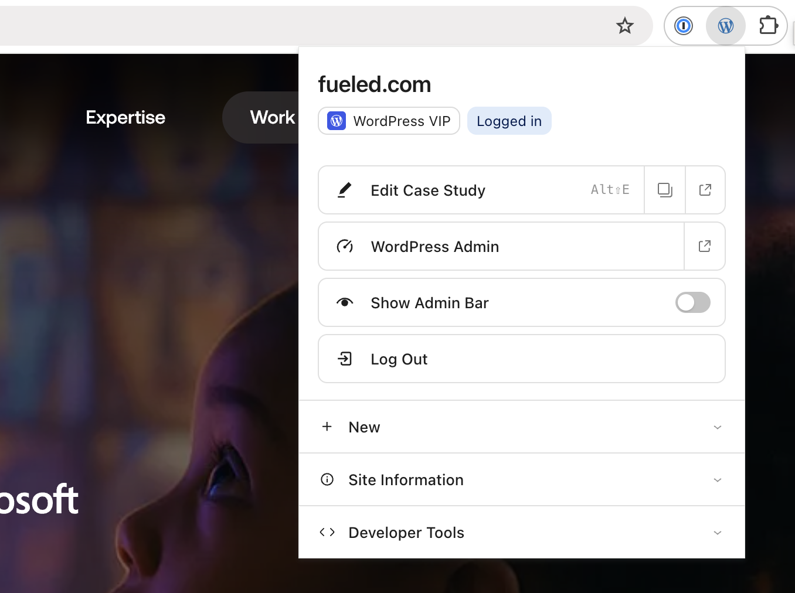
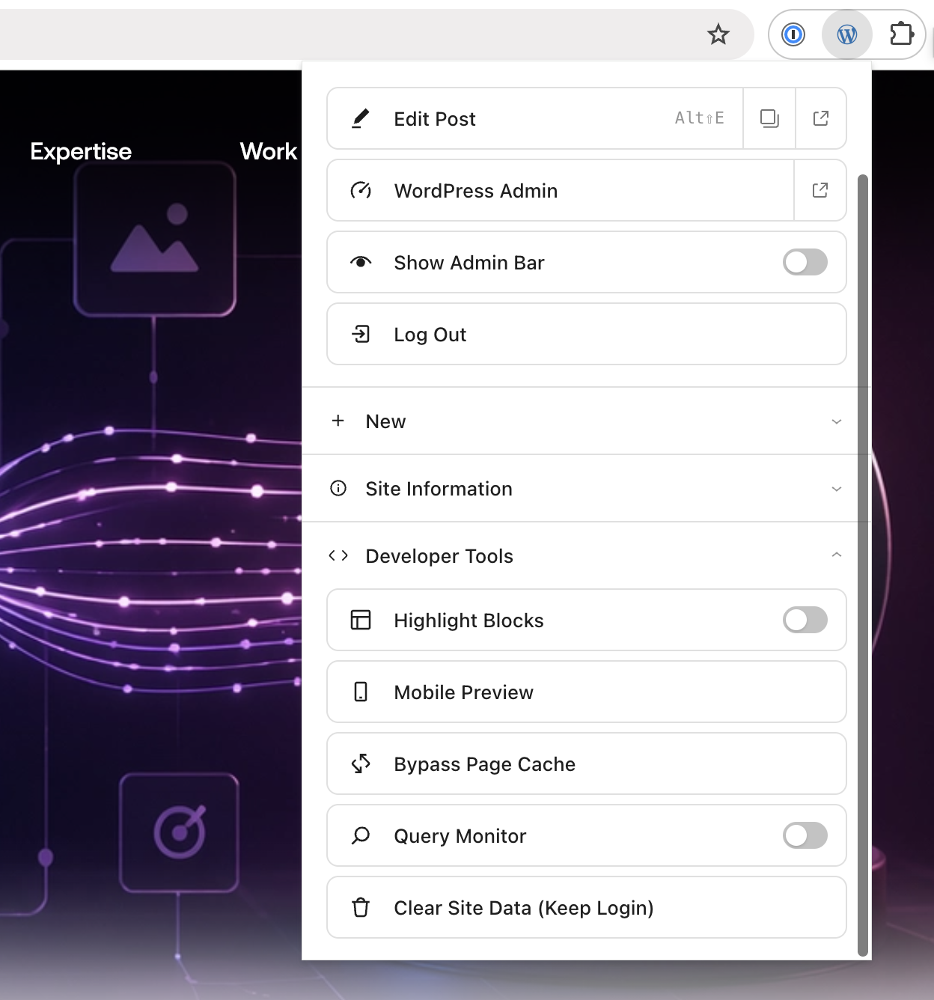
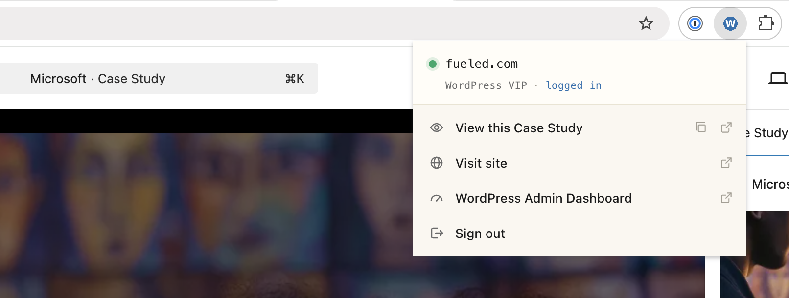
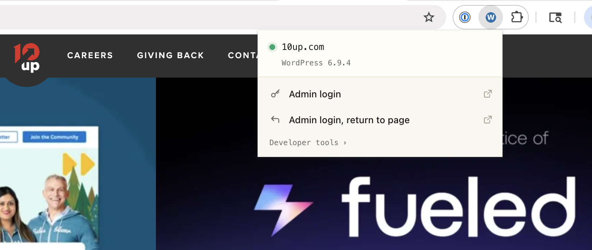
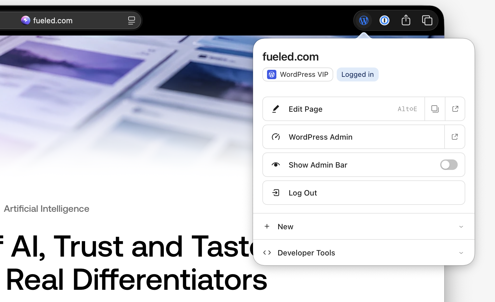

# WordPress Browser Extension

> **Heads-up:** This codebase is in discussion to become the official WordPress browser extension. Active development is happening here in the interim; the eventual home will be in the WordPress org.

A browser extension that detects WordPress sites and puts admin shortcuts, hosting info, and developer tools in your toolbar. Chrome is the primary target; Safari is supported via a companion Xcode project.

<p align="center">
  
  
</p>
<p align="center">
  
  
</p>
<p align="center">
  
</p>

## Install

### Chrome

1. Download the latest zip from [Releases](https://github.com/jakemgold/wordpress-browser-extension/releases)
2. Unzip to a folder
3. Open `chrome://extensions`, enable **Developer mode**
4. Click **Load unpacked** and select the unzipped folder

### Safari

See [SAFARI.md](SAFARI.md) — requires Xcode and a one-time Xcode Run (⌘R).

## Features

- **Detect WordPress** — Identifies WP sites automatically via REST API links, generator tags, asset paths, and body classes. The toolbar icon has three states: gray with a slash for non-WP, gray for WP, blue for WP and logged in.
- **Edit this page** — Jump straight to the editor for posts, pages, categories, tags, authors, and custom post types — including hyphenated CPT slugs like `case-study`. Keyboard shortcut: `Alt+Shift+E` (`Option+Shift+E` on Mac), customizable at `chrome://extensions/shortcuts`.
- **View / Preview from the editor** — On wp-admin edit screens, see the published page or preview a draft (with nonce) in one click. Works for all post types.
- **+ New content menu** — Mirrors the admin bar's "+ New" dropdown with the post types your role can create.
- **Identify the host** — Detects WP Engine, WordPress VIP, Pantheon, Kinsta, Flywheel, Cloudways, WordPress.com, Pressable, and local dev environments. Cached per origin for 90 days.
- **Toggle the admin bar** — Hide or show the front-end admin bar per site, without flash. Honors your profile setting and surfaces a clear hint when WP itself has the bar disabled.
- **One-click sign out** — Inline confirm, then logs out via the admin bar's nonce so WordPress's "are you sure?" page is skipped.
- **Site Information panel** — Active theme (name, version, author) and a wrap of plugin pills with version-on-hover. Pills link to each plugin's homepage. Powered by the WP REST API for admins, with DOM-scanned slugs as a graceful fallback.
- **Developer tools** — Mobile preview window (iPhone-sized), bypass page cache, clear cookies + site data (preserving your WP login), Highlight Blocks (outline `wp-block-*` elements with a breadcrumb tooltip), and a Query Monitor toggle when QM is installed.

## Development

The popup UI is React + [`@wordpress/ui`](https://www.npmjs.com/package/@wordpress/ui), bundled with [10up-toolkit](https://github.com/10up/10up-toolkit). The background service worker, content scripts, and `lib/*.js` are still vanilla — no build step there.

```
npm install
npm run build     # production bundle → dist/
npm start         # watch mode
```

Run smoke tests for `lib/` with `cd test && npm install && npm test`.

## Credits

Substantial contributions from [Fabian Kägy](https://github.com/fabiankaegy):
the React popup architecture, the Safari companion Xcode project, the Site
Information panel, and the Block Inspector — all merged from his fork at
[fabiankaegy/wp-detective](https://github.com/fabiankaegy/wp-detective)
with authorship preserved.

## License

MIT

## Like what you see?

<a href="http://10up.com/contact/"></a>
